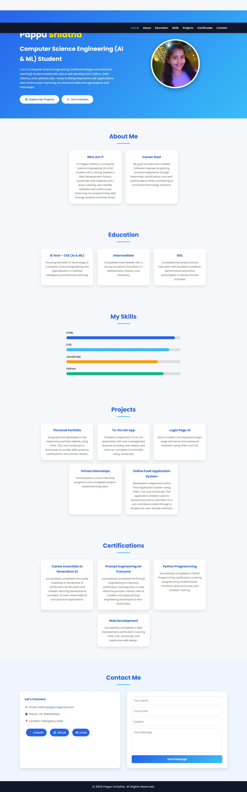

# 🌐 Personal Portfolio Website

## 📌 Project Title

Personal Portfolio Website

---

## 🎯 Objective

The objective of this project is to create a responsive and visually appealing personal portfolio website using HTML, CSS, and JavaScript. The website showcases my profile, technical skills, projects, education, certifications, and contact information in a professional and organized manner.

---

## ✨ Features

- Responsive design
- Home section
- About Me section
- Skills section
- Projects section
- Certifications section
- Contact section
- Profile image
- Smooth navigation
- Modern and attractive user interface

---

## 🛠️ Technologies Used

- HTML5
- CSS3
- JavaScript

---

## 📂 Project Structure

```text
Portfolio/
│── screenshots/
│   └── output.jpeg
│── index.html
│── profile.jpeg
│── script.js
│── style.css
│── README.md
│── Report.docx
```

---

## ▶️ How to Run the Project

1. Download or clone this repository.
2. Open the project folder.
3. Open the `index.html` file in any modern web browser.
4. Explore the portfolio website using the navigation menu.

---

## 📸 Screenshots

### Portfolio Output



---

## 💡 Learning Outcomes

Through this project, I learned:

- Building responsive web pages using HTML5
- Styling websites with CSS3
- Adding interactivity using JavaScript
- Creating a professional portfolio website
- Organizing project files
- Using Git and GitHub for version control

---

## 🚀 Future Improvements

- Resume download feature
- Contact form with backend integration
- Dark mode
- More animations and transitions
- Additional projects and certifications
- Performance optimization

---

## 👩‍💻
Pappu Srilatha
